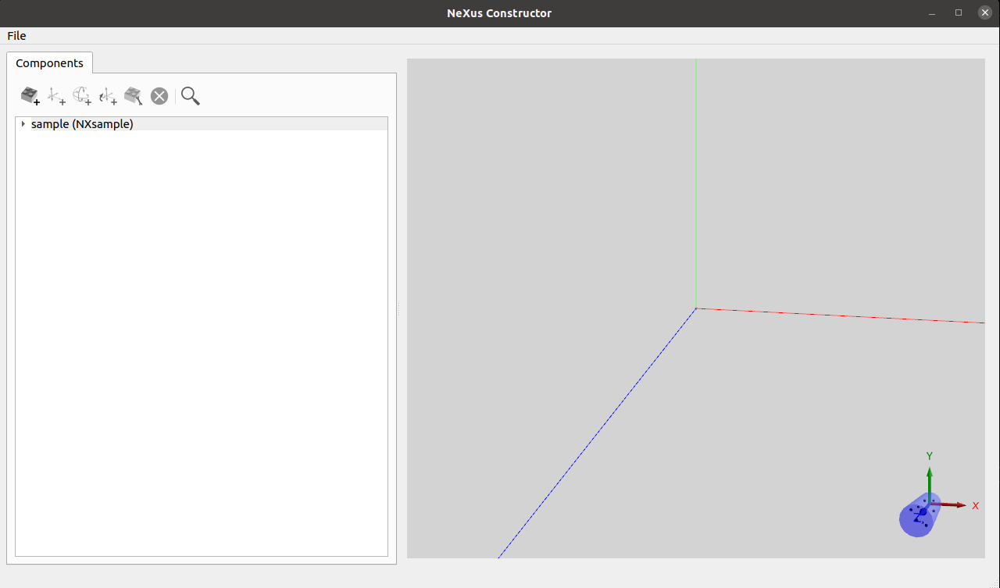
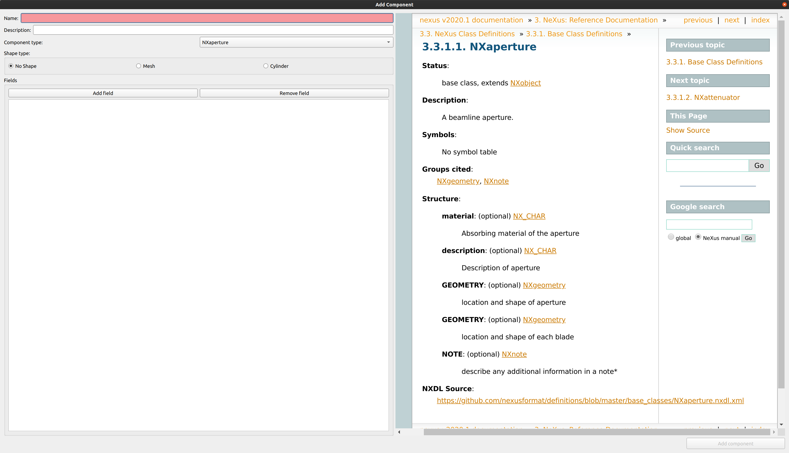
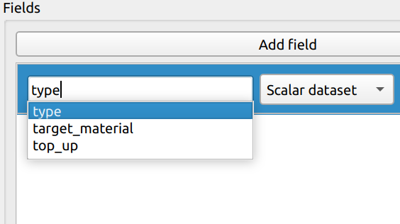
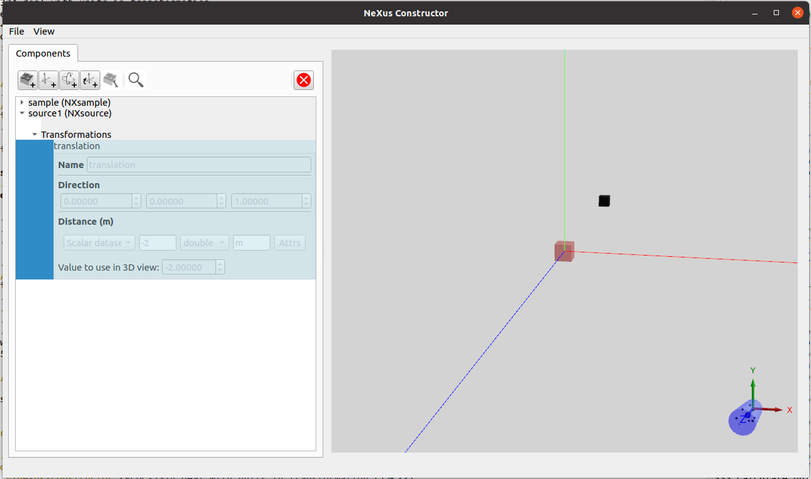
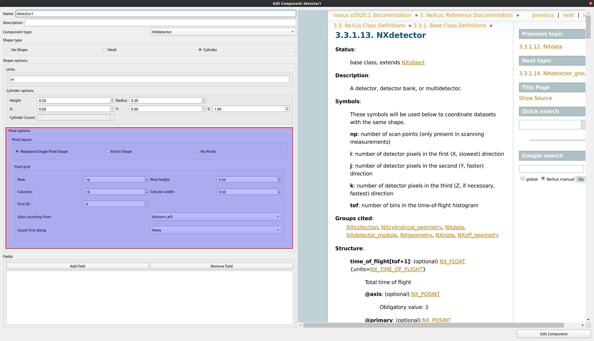
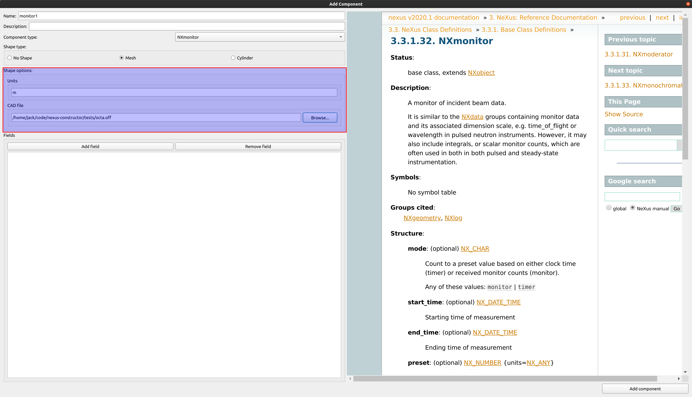
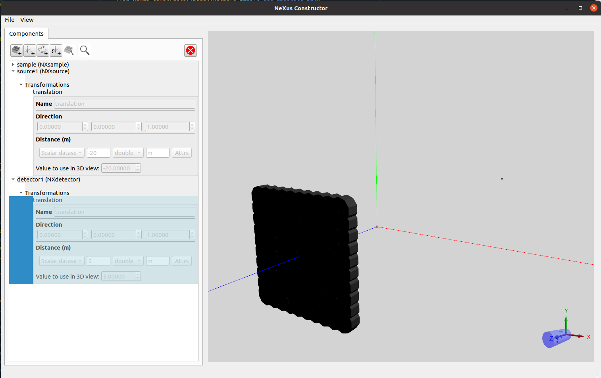

# Getting started

To introduce the main features of the NeXus Constructor we will create a NeXus file template describing a simple neutron beamline, comprising a neutron source, sample and detector.

Firstly, either download the [latest release](https://github.com/ess-dmsc/nexus-constructor/releases) for your OS and run the executable from the root directory, or run the source (refer to the [README](README.md) for instructions on how to do this).

You will be shown the main window of the application (pictured below) which contains a list of *components* which comprise the beamline, and a 3D view visualising the components listed with their respective shape and position.

In the [NeXus Format](https://www.nexusformat.org/), a component is essentially a group that can contain *fields*(members of the component group) specific to the type of component. These components contain an attribute called `NX_class` which describes the type.
 
The sample component is added by default, and is indicated by the red cube. You can move around the 3D view by using the arrow keys to move, click+drag to pan, and pgup/down to zoom.

If you are familiar with the NeXus format it may be useful to view the layout of the resulting NeXus file as you modify the template by adding components and other information. You can do this by clicking the "Nexus File Layout" tab in the left pane of the main window.

## Adding components

Click the "add component" button.

In this screen, we are given options to set what type of component it is, its shape, as well as being able to add fields to describe it further.
As well as these options, the NeXus format documentation for the component type selected is shown on the right. This suggests what fields to add. You can add undocumented fields with additional information, but the ones in the documentation may be able to be used by other software which reads NeXus files.

### Adding a source

To add a source, use the add component window and select "NXsource" from the drop-down containing all of the component types. 

This component will need a name, which correlates to the group name in the NeXus file. In this example, we will name it `source1`.

As you can see highlighted in the documentation, we can add a field to describe the source. To do this, select the "add field" button.

When inputting the name of the field, in this case we'll add "type", you will see that typing in the name edit will bring up an autocompleter with all of the possible field names. This corresponds to the documentation on the right.

Set the data type of the field by selecting the type combo and selecting "String". In the value edit, enter one of the options specified in the "type" field in the documentation on the right. In this case, let's use `Spallation Neutron Source`

When finished, hit the "add component" button to save it (Note: you can edit this component once saved by selecting it in the list and using the "edit component" button near to the add button). 
You will notice in the 3d view there is a new square which has been added that is black. This would be incorrect in real life, as the source is likely not going to be hitting the sample straight away. To remedy this we should add a transformation to the newly added source component.

#### Setting translation on the source

To the right of the Add component button in the main window toolbar, three additional controls can be used to add transformations to a component. Here we have the option to translate, rotate and link to another component's transformations. 

In this case, we will add a translation, so we can move the source to it's correct position. To do this, first select the source component in the list by clicking it, then click the "add translation" button.

You will see upon adding a new translation the black cube gets shifted to the right immediately. This is because of the default vector specified in the translation. By default the field is disabled, but to edit these fields simply click on it. When finished editing, clicking elsewhere in the list will save the changes. 

 

As the source distance will be static and its position will likely not change throughout the experiment, we can set this to a scalar value. A realistic value would have a vector of (0,0,1) and the distance would be `-20m`. Distance units can be changed with the units field next to the value. For this value a float data type should be used, which is the default anyway. 

You will notice after inputting values that the black cube moves behind the sample cube. This is because it is now -20 metres behind it on the z-axis. 

### Adding a detector 

*Detectors* are a key component of any beamline, as they detect the speed and intensity of neutrons/muons/photons after (or before) the beam has passed through the sample. We can use a grid of detectors to formulate an image of the scattered beam.  

Detectors can be added in the same way as other components, but can contain *pixel data* in addition to their shape. When a detector or detector module component type is selected and shape information is inputted, the pixel data options will appear.
This is important because some detectors are made up of a grid of pixels, and this needs to be portrayed in the constructor to show the position of each. In our case, we will set the shape type to cylinder and the outcome should look like this:

In this example our detector is comprised of a 16x16 grid of pixels.

To replicate this in the NeXus Constructor, first create a component with `NXdetector` as it's component type. After this, select `Mesh` as the geometry type. This will show the pixel data edits like so:
 
 

We will select the "repeated single pixel shape" here and enter the rows and columns as 16. The row and column heights can be left as their default values. 

Next we need to select a shape file; 

##### Loading shape from a CAD file
Alternatively to cylinder shapes, mesh shapes can be used for components to describe their shape. Currently STL and OFF files are supported for mesh geometry. 

To use a mesh file for geometry, select the "Mesh" geometry type. This will show an option to browse for a file. As well as this, units can also be set to change the scale of the geometry.
To test this, there are OFF and STL files in the `tests/` folder. Let's use the "cube.off" file.   

When hitting add, you will notice that the 3D view is updated should contain a grid of 16x16 cubes. We now just need to move it backwards from the sample by applying another transformation.

We now have a very basic example of a beamline instrument visualised in 3D as well as the resulting NeXus file. The NeXus Constructor can output to a JSON as well, which is used by the file-writer to aggregate event data and other live-streamed data to the file. 

### Opening and saving file-writer commands 

The constructor can output to a [file-writer command](https://github.com/ess-dmsc/kafka-to-nexus/blob/master/documentation/commands.md) in JSON format, and can also load from these files.
To save to a JSON file, open the file menu and click "Save to filewriter JSON". This will bring up a file dialog in order to save the file. 

To open a JSON file, open the file menu and click "Open from filewriter JSON". The constructor will then load in all components and their fields from a given file. 

#### Sending a command to the file-writer

As well as saving the NeXus structure to file, a run start message can be constructed and sent to an instance of the [file-writer]((https://github.com/ess-dmsc/kafka-to-nexus)
To do this, open the file menu and select "Control file writer". This will bring up a dialog that enables a user to input [Kafka topic](https://kafka.apache.org/documentation/#intro_topics) URIs to look at the status of any active file-writers or to send a command to one. 

### Opening and saving to NeXus File

As well as to and from JSON, a NeXus File can be saved to and loaded from into the NeXus Constructor. 

Actions in the file menu can be used for this and components should be identified by the Constructor when loading other NeXus files. 
