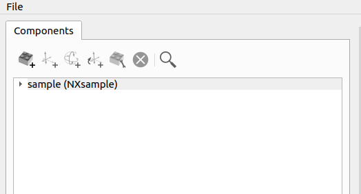

start up application empty 
build simple instrument, source sample detector, chopper
cover import from cad file 
cover field types - stream  
cover file-writer command window
pixel data for grid detectors 
saving and loading from a nexus file 

# Getting started

Firstly, start the application by running `python3 main.py`.

You will be shown the main window of the application (pictured below) which contains both a list of components and a 3D view visualising the components listed with their respective shape and position. 
The sample component is added by default, and is indicated by the red cube.

By clicking the "Nexus File Layout" tab in the left pane of the window, the NeXus file layout can be shown in a tree structure.

## Adding components

The "add component" button, found in the layout above the list of components (pictured) can be clicked to open a dialog containing possible fields and options a component may include.

In this screen, we are given options to set what type of component it is, its type of shape as well as being able to set arbitrary fields.
As well as these options, the NeXus format documentation for the component type selected is shown on the right. This shows the required and optional fields for this type of component and what type of data the field should be.

### Adding a source

To add a source, use the add component window and select "NXsource" from the drop-down containing all of the component types. 

This component will need a name, which correlates to the group name in the NeXus file. In this example, we will name it `source1`.

A source has no geometry in real life as it is the neutron beam itself, so leave the radio button marked as "no shape" checked.

As you can see highlighted in the documentation, we can add a field to describe the source. To do this, select the "add field" button. This will add a blank field in the list below it. 

When inputting the name of the field, in this case we'll add "type", you will see that typing in the name edit will bring up an autocompleter with all of the possible field names. This corresponds to the documentation on the right.

After this, We should set the data type of the field by selecting the type combo and selecting "String". Then, in the value edit, we will enter one of the options specified in the "type" field in the documentation on the right. In this case, lets use `Spallation Neutron Source`

When finished, hit the "add component" button to save it (Note: you can edit this component once saved by selecting it in the list and using the "edit component" button near to the add button). 
You will notice in the 3d view there is a new square which has been added that is black. This would be incorrect in real life, as the source is likely not going to be hitting the sample straight away. To remedy this we should add a transformation to the newly added source component.

#### Setting translation on the source

### Adding a detector 
#### Loading shape from a CAD file
Currently STL and OFF files are supported for mesh geometry. 
#### Setting pixel data

### Adding a chopper

### Opening and saving file-writer commands 

#### Sending a command to the file-writer

### Opening and saving to NeXus File

