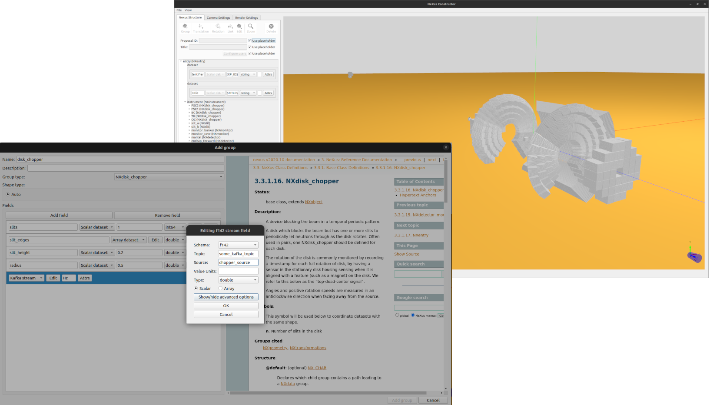

[](https://github.com/ess-dmsc/nexus-constructor/blob/main/LICENSE) [](https://codecov.io/gh/ess-dmsc/nexus-constructor) [](https://jenkins.esss.dk/dm/job/ess-dmsc/job/nexus-constructor/job/main/) [](https://github.com/python/black)

# NeXus Constructor
The NeXus Constructor facilitates constructing [NeXus files](https://www.nexusformat.org/) in which to record data from
experiments at neutron science facilities. This includes all supporting metadata typically required to perform analysis
of such experiments, including instrument geometry information.

The application can directly output a NeXus file, or create a
[_NeXus structure_, JSON template](https://github.com/ess-dmsc/kafka-to-nexus/blob/master/documentation/commands.md#defining-a-nexus-structure)
of the file to send to the [File Writer](https://github.com/ess-dmsc/kafka-to-nexus). The JSON template can
include data stream details, such that the File Writer populates the NeXus file it creates with data acquired
from the detector and other beamline apparatus during an experiment.

There is a ["Getting Started" guide](getting_started.md) to help new users.



Although the application may be useful to other institutions using NeXus, the NeXus Constructor is being
developed as part of the software suite for the
[European Spallation Source (ESS)](https://europeanspallationsource.se/). Please see
[this (open access) paper](https://iopscience.iop.org/article/10.1088/1748-0221/13/10/T10001)
for more information on the ESS software.

The NeXus Constructor should work on MacOS, Linux and Windows; however, none of the current developers use Windows, so occasionally there are issues on Windows - if you find one then please let us know!

### Installing dependencies

Binary packages for release versions can be downloaded on the [releases page](https://github.com/ess-dmsc/nexus-constructor/releases),
or to run the latest development version please follow the instructions below.

Python 3.8 or greater is required. https://www.python.org/downloads/

It is **HIGHLY** recommended that a virtual environment is created for running the nexus-constructor.

Runtime Python dependencies are listed in requirements.txt at the root of the
repository. They can be installed from a terminal by running
```
pip install -r requirements.txt
```
For MacOS Ventura, it is currently necessary to install libomp manually, e.g. via brew, MacPorts, etc.

### Usage

Run the Python script `nexus-constructor.py` located in the root of the repository.

A guide for getting started with the nexus-constructor can be found [here](getting_started.md)

## Developer information

### Development dependencies

Development dependencies (including all runtime dependencies) can be installed by using the following command

```
pip install -r requirements-dev.txt
```

Install the pre-commit hooks by running the following command

```
pre-commit install
```

Now when a commit is made, the hooks will be run automatically.

For more information on pre-commit see the [official documentation](https://pre-commit.com)

### Developer Documentation

See the [Wiki](https://github.com/ess-dmsc/nexus-constructor/wiki/Developer-Notes) for developer documentation.

## Contributing

### The project
The project is managed on the ESS's JIRA system which is [here](https://jira.esss.lu.se/browse/ECDC).

If you do not have an ESS account but want to raise an issue then please open an issue on the repository. Someone will
triage it and link it from the JIRA system.

### Pull requests
Pull requests are very welcome and should be done through GitHub in the standard way.

### Code

If you are submitting code then please ensure it passes the pre-commit checks (see above).
