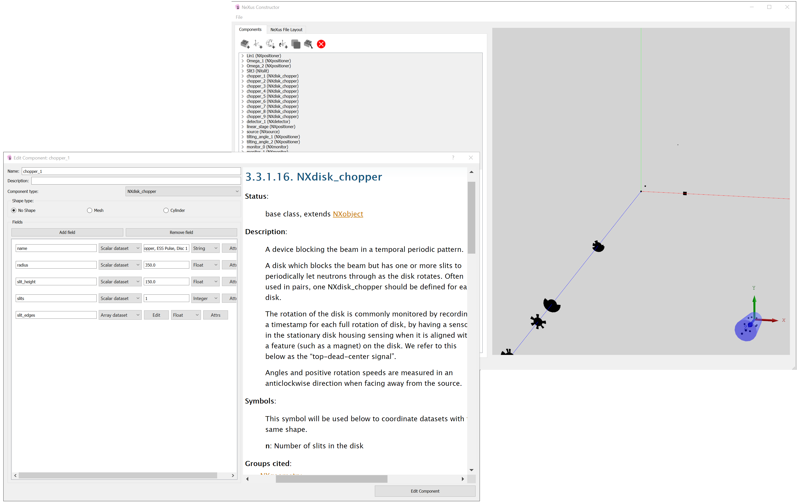

[](https://github.com/ess-dmsc/nexus-constructor/blob/master/LICENSE) [](https://codecov.io/gh/ess-dmsc/nexus-constructor) [](https://jenkins.esss.dk/dm/job/ess-dmsc/job/nexus-constructor/job/master/) [](https://github.com/python/black)

# NeXus Constructor
Construct [NeXus files](https://www.nexusformat.org/) with instrument geometry information using a GUI.



Currently tested on Windows 10 and CentOS 7, it should also work on other Linux distributions. Currently it does not work on Mac due to a bug in Qt, but we hope to resolve this soon.

## Installing dependencies

This project is developed for Python 3.6, so an install of 3.6 or higher
is required. https://www.python.org/downloads/

Runtime Python dependencies are listed in requirements.txt at the root of the
repository. They can be installed from a terminal by running
```
pip install -r requirements.txt
```

### Development dependencies

Development dependencies (including all runtime dependencies) can be installed by using the following command: 

```
pip install -r requirements-dev.txt
```

The black pre-commit hook (installed by [pre-commit](https://pre-commit.com/)) requires Python 3.6 or above.
You need to once run
```
pre-commit install
```
to activate the pre-commit check.

## Running the application

Run the python script `nexus-constructor.py` located in the root of the repository.

## Developer Documentation

See the [Wiki](https://github.com/ess-dmsc/nexus-constructor/wiki/Developer-Notes) for developer documentation.
