<!-- TOC depthFrom:1 depthTo:8 withLinks:1 updateOnSave:1 orderedList:0 -->

- [Getting started](#getting-started)
	- [Adding components](#adding-components)
		- [Adding a source](#adding-a-source)
			- [Setting translation on the source](#setting-translation-on-the-source)
		- [Adding a detector](#adding-a-detector)
		- [Adding a Monitor](#adding-a-monitor)
				- [Loading shape from a CAD file](#loading-shape-from-a-cad-file)
		- [Opening and saving file-writer commands](#opening-and-saving-file-writer-commands)
			- [Sending a command to the file-writer](#sending-a-command-to-the-file-writer)

# Getting started
To introduce the main features of the NeXus Constructor we will create a NeXus file template describing a simple neutron beamline, comprising a neutron source, sample, detector and monitor.

Firstly, either download the [latest release](https://github.com/ess-dmsc/nexus-constructor/releases) for your OS and run the executable from the root directory, or run the source (refer to the [README](README.md) for instructions on how to do this).

You will be shown the main window of the application (pictured below) which contains a list of *components* which comprise the beamline, and a 3D view visualising the components listed with their respective shape and position.

You can move around the 3D view by using the arrow keys to move, click+drag to pan, and pgup/down to zoom.

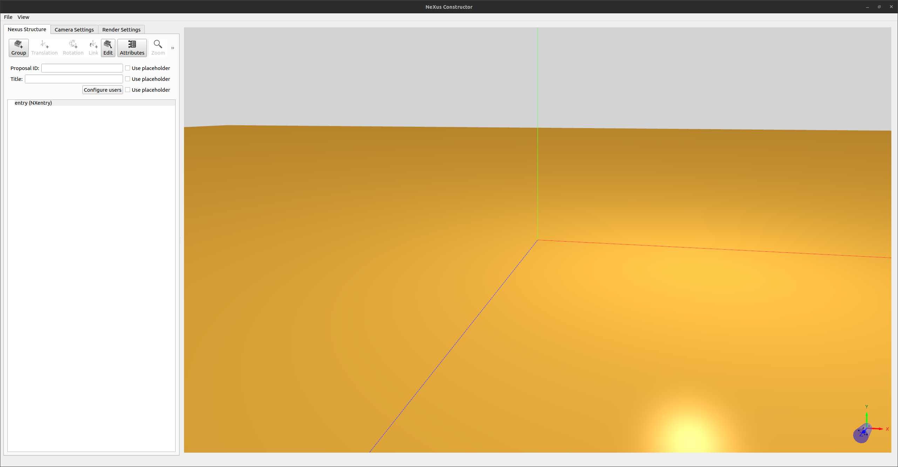

## Adding components

Click the "Group" button.

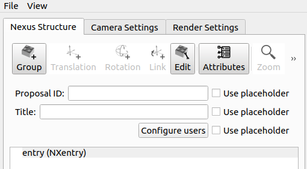

In this screen, we are given options to set what type of component it is, its shape, as well as being able to add fields to describe it further.
As well as these options, the NeXus format documentation for the component type selected is shown on the right. This suggests what fields to add. You can add undocumented fields with additional information, but the ones in the documentation may be able to be used by other software which reads NeXus files.

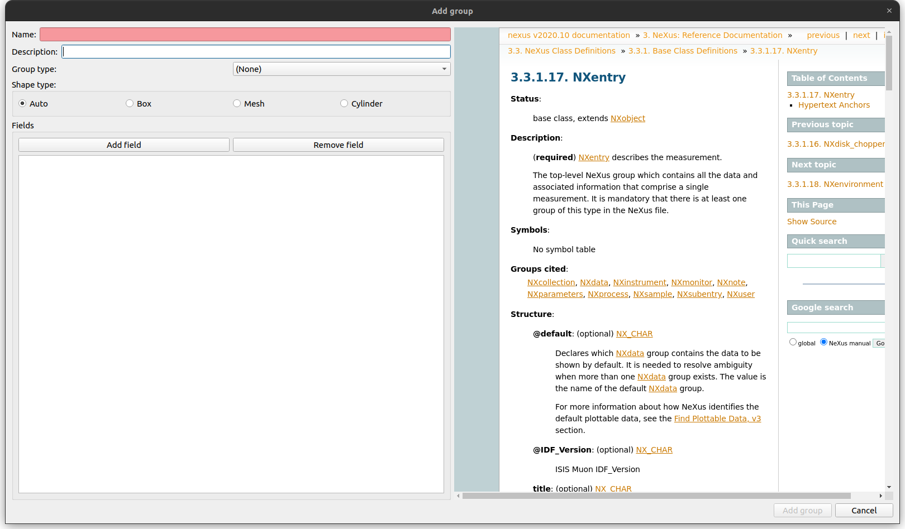

### Adding a source

In the add component window select "NXsource" from the drop-down containing all of the component types.

Name the component as "source1".

As you can see highlighted in the documentation, we can add a field to describe the source. To do this, select the "add field" button.

When inputting the name of the field, in this case we'll add "type", you will see that typing in the name edit will bring up an autocompleter with all of the documented field names.

Set the data type of the field by selecting the type combo and selecting "String". In the value edit, enter one of the options specified in the "type" field in the documentation on the right. In this case, let's use `Spallation Neutron Source`

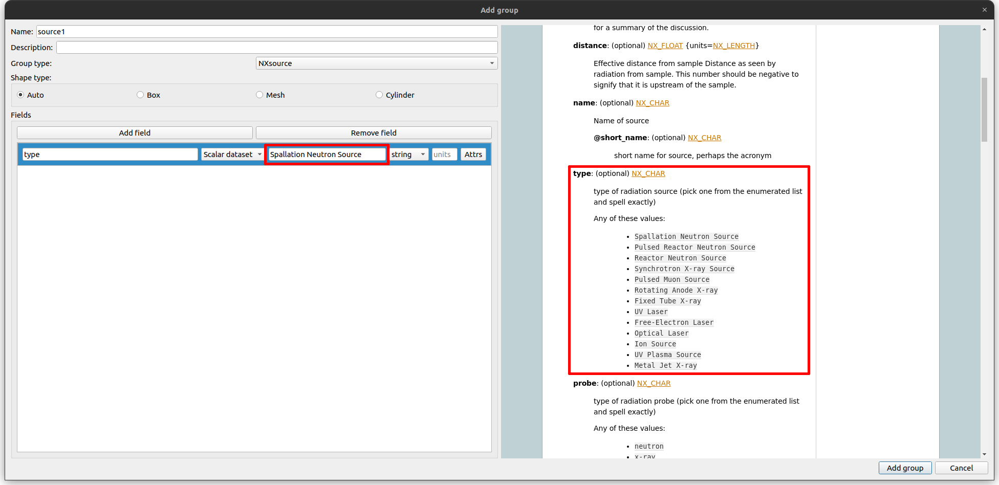

Hit the "Add group" button to save it (Note: you can edit this component once saved by selecting it in the list and using the "Edit component" button near to the add button).
You will notice in the 3d view there is a new cube which has been added that is grey. To move the source away from the origin we will add a transformation to the newly added source component.

#### Setting translation on the source

To the right of the "Group" button in the main window toolbar, three additional controls can be used to add transformations to a component. Here we have the option to translate, rotate and link to another component's transformations.

Select the source component in the list by clicking it, then click the "Translation" button.

You will see upon adding a new translation the cube gets moves immediately. This is because of the default vector specified in the translation. By default the field is disabled, but to edit these fields simply click on it. When finished editing, clicking elsewhere in the list will save the changes.

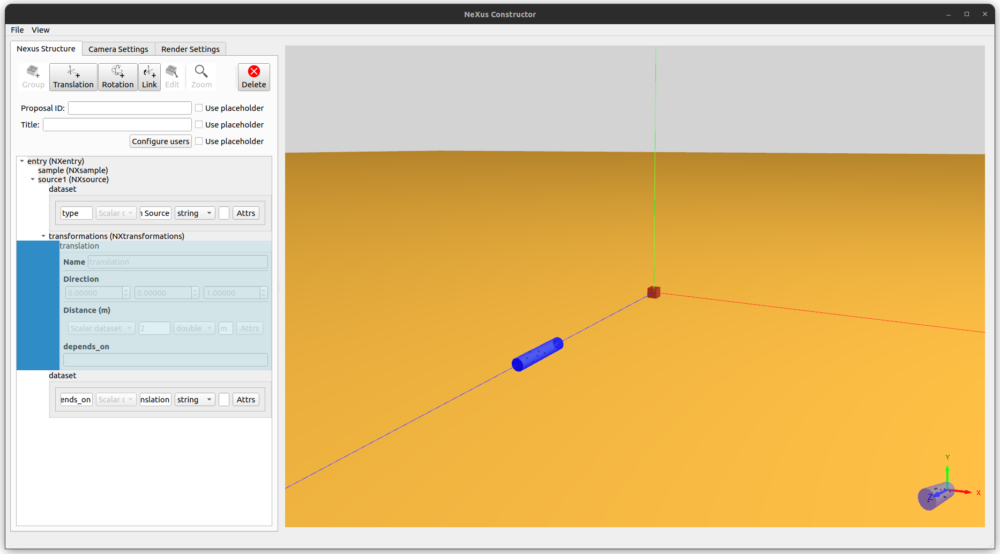

The beam direction is conventionally along the z-axis, so use a vector of (0,0,1) and the set a distance of `-2m`. Distance units can be changed with the units field next to the value.

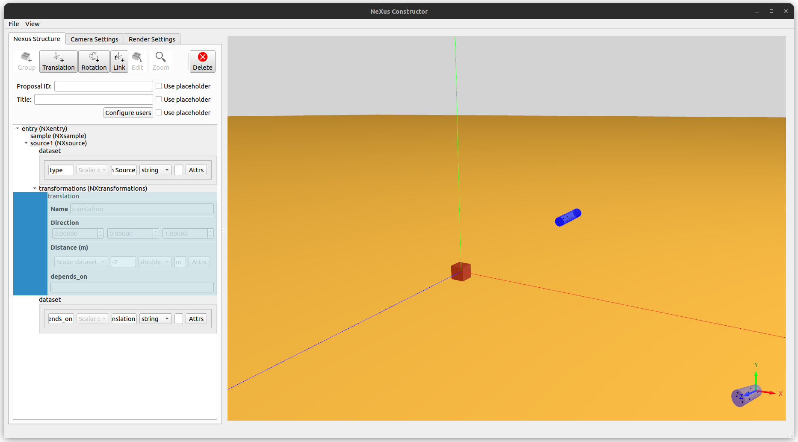

### Adding a detector

*Detectors* are a key component of any beamline. A detector comprised of an array of detecting pixels can be used to infer the angle that the neutrons/muons/photons scattered from the sample.

Enter the "Add group" dialog and select "NXdetector" as the component type. Notice pixel data options appear.

In this example our detector is comprised of a 16x16 grid of pixels.

Select "Cylinder" as the "Shape type" and set the height as 0.5 and radius as 0.3, and leave the units as "m".

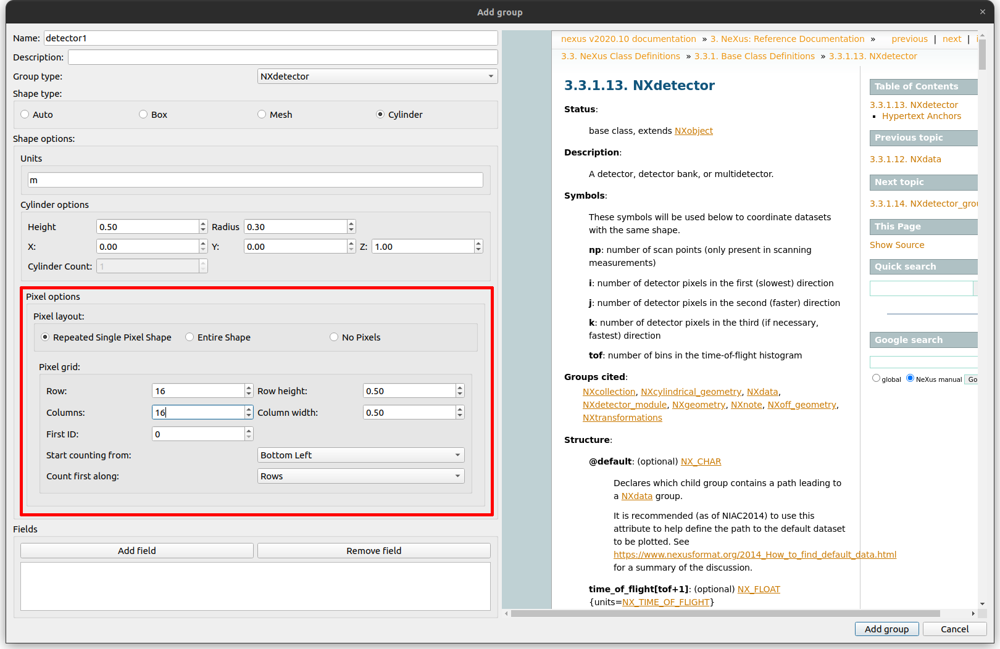

We will select the "repeated single pixel shape" here and enter the rows and columns as 16. The row and column heights can be left as their default values.

When hitting add, you will notice that the 3D view is updated should contain a grid of 16x16 cylinders. We now just need to move it backwards from the sample by applying another transformation of 5 metres along the z-axis.

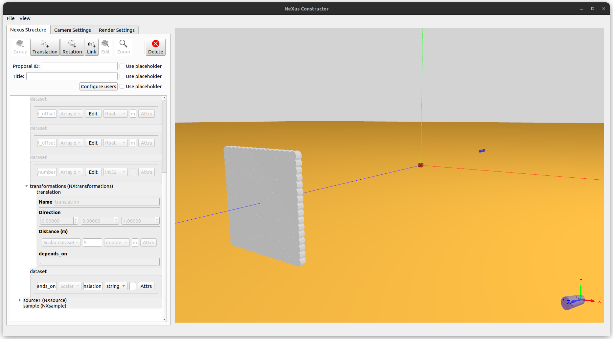

### Adding a Monitor

We will add a monitor with a mesh shape to the instrument. To do this, add another component.
When the Add component Dialog is shown, select "NXmonitor" as the component type.

##### Loading shape from a CAD file
Alternatively to cylinder shapes, mesh shapes can be used for components to describe their shape. Currently STL and OFF files are supported for mesh geometry.

To use a mesh file for geometry, select the "Mesh" geometry type. This will show an option to browse for a file. As well as this, units can also be set to change the scale of the geometry.
To test this, there are OFF and STL files in the `tests/` folder. Let's use the "cube.off" file.

Again, this would need to be moved away from the sample if reflecting a real scenario. It may also need to be rotated. To add multiple transformations, select "Add rotation" or "Add translation" in the order you want them to be added.

### Usage of Streams in components fields and transformations.

While adding fields or transformation to a component, until now we only used either `Scalar dataset` or `Array dataset`.
These are examples of static datasets. Nexus-constructor also allows you to provide configuration for the datastreams (`kafka streams`) for the component's fileds or transformations.

In the figure below, you find an example where `rotation_speed` field of a disk chopper is configured as `kafka stream`
instead of `Scalar or Array dataset`. Choosing `kafka stream` option from the dropdown opens another dialog window where there are options to pick the schema for the `kafka stream` (in this example an [f142](https://github.com/ess-dmsc/kafka-to-nexus/blob/main/documentation/writer_module_f142_log_data.md)). In the example below, `topic` input is the kafka topic where data for chopper `rotation_speed` will be available. There are certain mandatory inputs for eg `topic` and `source` which are common across all the [file-writer](https://github.com/ess-dmsc/kafka-to-nexus) supported [schemas](https://github.com/ess-dmsc/kafka-to-nexus/tree/main/documentation).

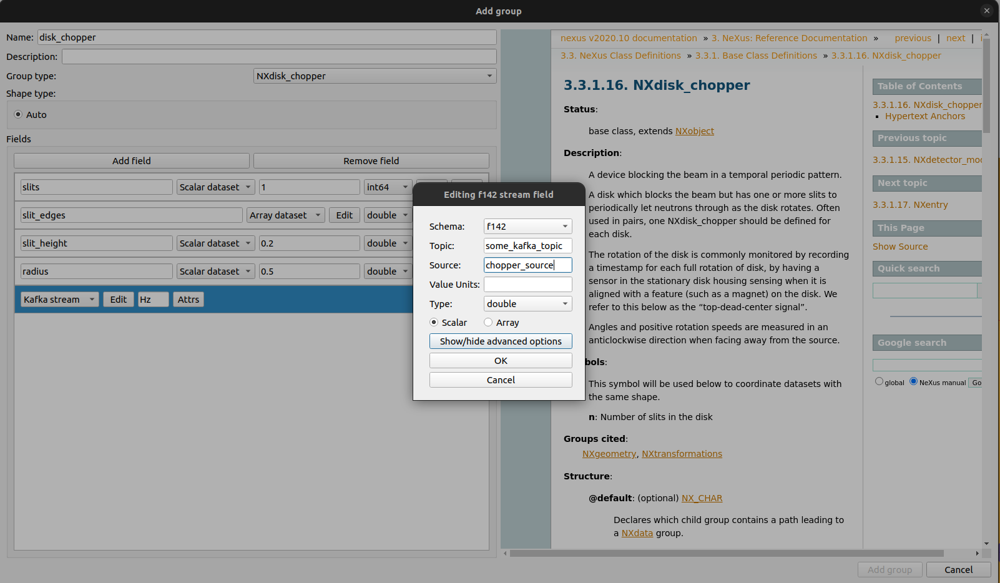

There are often cases where the components (for eg. a detector bank, chopper etc) are installed on platforms that can be translated or rotated with the help of motors during the course of experiment. In such cases datastreams (`kafka stream`) should be used when adding translation/rotation for the component. In this particular case a chopper translation along the `z` direction is assumed to be controlled by a motor (`some_motor_name`) and the information about its datastreams is provided by editing the configurations in `kafka stream` dialog window.

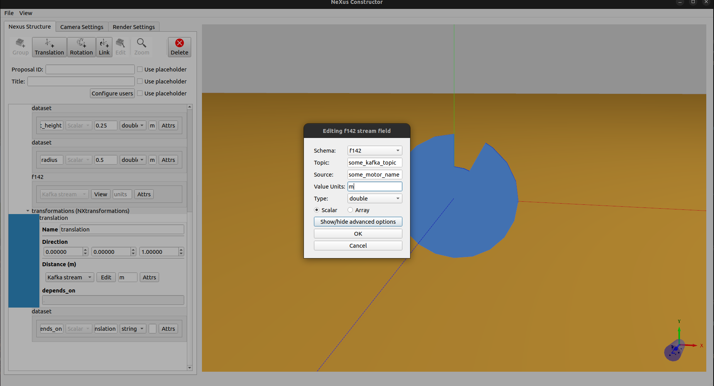

### Opening and saving file-writer commands

We now have a very basic example of a beamline instrument visualised in 3D as well as the resulting NeXus file. The constructor can output to a [file-writer command](https://github.com/ess-dmsc/kafka-to-nexus/blob/master/documentation/commands.md) in JSON format, and can also load from these files.
To save to a JSON file, open the file menu and click "Save to filewriter JSON". This will bring up a file dialog in order to save the file.

To open a JSON file, open the file menu and click "Open from filewriter JSON". The constructor will then load in all components and their fields from a given file.

## Render settings

In the render settings tab, it is possible to change if the program should render the full geometries or just the convex hulls for large geometries.
It is also possible to change the colours of materials.

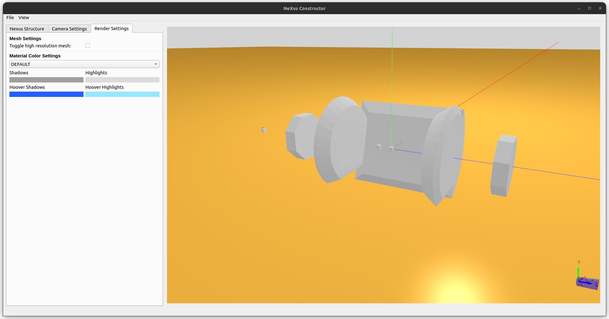

### Show high resolution

By default, any large geometry loaded won't be fully rendered. The convex hull of the geometry will be shown instead to improve performance. 
After meshes have been loaded, the toggle high resolution checkbox will trigger the program to load and render the full geometries of all objects. This may take a long time and might crash the program if the computer lacks enough available memory and video memory.

### Colour settings

Choosing a material class in the dropdown menu makes it possible to change the used colour palette. By pressing the colour rectangles, a colour picker will open where colour can be chosen.

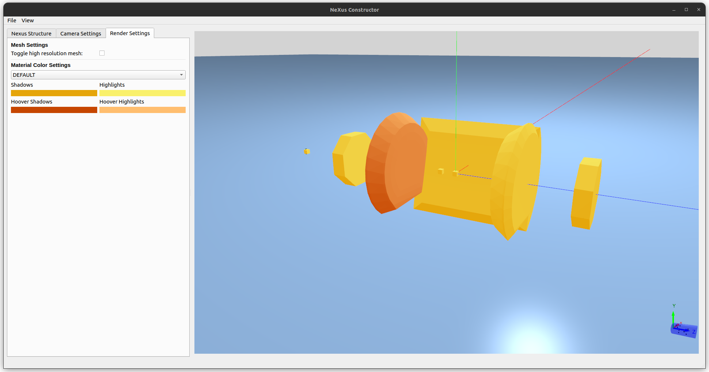